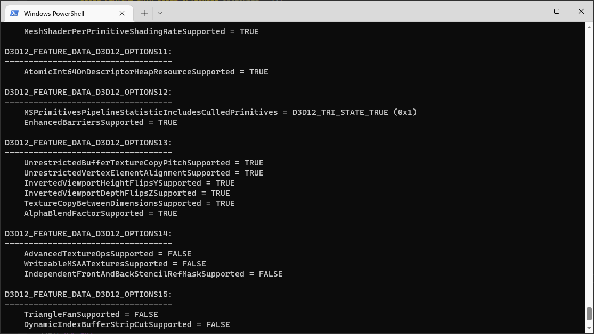

# D3d12info

A Windows console program that outputs all the information about the GPU (graphics chip) installed in the system, through DXGI and Direct3D 12 (D3D12) + AMD AGS, NVAPI, WinAPI, and some other sources.



Inspired by `vulkaninfo` - a similar tool that prints all the information about device capabilities using Vulkan API.

An alternative for D3D12 is a GUI program "DirectX Caps Viewer", which is part of Windows SDK and can be found in path like:
`c:\Program Files (x86)\Windows Kits\10\bin\*\x64\dxcapsviewer.exe`.

# GUI and online database

- Online database of GPU capabilities:
  - **https://d3d12infodb.boolka.dev/**
- GUI application that can display the capabilities of the current GPU and submit them to the database:
  - **https://github.com/Devaniti/D3d12infoGUI/releases**

*(These projects are managed by [\@Devaniti](https://github.com/Devaniti))*

# Download

To download compiled binary of this console app, go to **[Releases](https://github.com/sawickiap/D3d12info/releases)**. This is a portable program - it doesn't need installation.

Version history can be found in file [CHANGELOG.md](CHANGELOG.md).

# Features

Following types of information are printed by the program:

- List of available DXGI adapters (GPUs) available in the system and their parameters, e.g. video memory size.
  - Software and WARP adapters can also be used (off by default).
- Direct3D 12 capabilities of the GPU, like `D3D12_FEATURE_DATA_D3D12_OPTIONS`, `D3D12_FEATURE_DATA_D3D12_OPTIONS2`, etc.
  - Latest DirectX Agility SDK is used for access to the latest features.
  - Preview version of the Agility SDK is supported by a separate executable "D3d12info_preview.exe".
- Capabilities of all the formats (off by default), e.g. whether `DXGI_FORMAT_R9G9B9E5_SHAREDEXP` can be used as a render target.
- Available meta commands and their parameters (off by default).
- Graphics driver version, fetched in a multitude of ways.
- Basic information about the operating system, e.g. Windows version, system memory size.
- Basic information fetched from Vulkan, focused on general GPU description and driver version.
- On AMD GPUs: Information fetched using their AGS library and device_info library, e.g. more detailed parameters of the hardware and the availability of custom extensions like `userMarkers`, `appRegistration`, `shaderClock`.
- On Nvidia GPUs: Information fetched using their NVAPI library, e.g. more detailed parameters of the hardware and the availability of custom extensions like `NVAPI_D3D12_RAYTRACING_CAPS_TYPE_THREAD_REORDERING`, `*OPACITY_MICROMAP`, `*DISPLACEMENT_MICROMAP`.
- On Intel GPUs: Information fetched from their GPU Detect library, e.g. more detailed parameters of the hardware.

Output is printed in a human-readable text format by default, but it can be switched to **JSON** format suitable for automated processing.

Following types of information are **not supported** by the program:

- Listing outputs (monitors) connected to the GPU or their parameters.
- DirectX Video.
- More information fetched from Vulkan, like extensions, properties, or limits. For them, please use [Vulkan Hadware Database by Sascha Willems](https://vulkan.gpuinfo.org/) and its accompanying app.
- Information fetched from Windows Display Driver Model (WDDM) API.

# Command-line syntax

```
Options:
  -v --Version                     Only print program version information.
  -h --Help                        Only print this help (command line syntax).
  -l --List                        Only print the list of all adapters.
  -a --Adapter=<Index>             Print details of adapter at specified index.
  --AllAdapters                    Print details of all adapters.
  -j --JSON                        Print output in JSON format instead of human-friendly text.
  --MinimizeJson                   Print JSON in minimal size form.
  -o --OutputFile=<FilePath>       Output to specified file.
  -f --Formats                     Include information about DXGI format capabilities.
  --MetaCommands                   Include information about meta commands.
  -e --Enums                       Include information about all known enums and their values.
  --PureD3D12                      Extract information only from D3D12 and no other sources.
  -x --EnableExperimental=<on/off> Whether to enable experimental features before querying device capabilities. Default is off for D3d12info and on for D3d12info_preview.
  --ForceVendorAPI                 Tries to query info via vendor-specific APIs, even in case when vendor doesn't match.
  --WARP                           Use WARP adapter.
```

# License

The project is open source under MIT license. See file [LICENSE.txt](LICENSE.txt).

# Building

The project uses Cmake. It is intended to be built using Microsoft Visual Studio 2022.
Before trying to build make sure to initialize sumbodules as they have required dependencies.
The source code depends on:

- C++ standard library, including some of the latest C++20 features
- WinAPI from Windows 10 with some reasonably new Windows SDK

It uses following third-party libraries:

- **[DirectX 12 Agility SDK](https://devblogs.microsoft.com/directx/directx12agility/)** - latest API to Direct3D, by Microsoft.
  - Embedded in directory: Src\ThirdParty\microsoft.direct3d.d3d12.*
- **[AMD GPU Services](https://github.com/GPUOpen-LibrariesAndSDKs/AGS_SDK)** - custom vendor extensions to graphics APIs by AMD.
  - Linked via submodule.
  - Optional, controlled by Cmake variable `ENABLE_AGS` - on by default.
- **[AMD device_info](https://github.com/GPUOpen-Tools/device_info)** - a library with a list of AMD GPUs. License: MIT.
  - Linked via submodule.
  - Optional, controlled by Cmake variable `ENABLE_AMD_DEVICE_INFO` - on by default.
- **[NVAPI](https://developer.nvidia.com/nvapi)** - custom vendor extensions to graphics APIs by Nvidia.
  - Linked via submodule.
  - Optional, controlled by Cmake variable `ENABLE_NVAPI` - on by default.
- **[Intel GPU Detect](https://github.com/GameTechDev/gpudetect)** - custom vendor extensions to graphics APIs by Intel. License: Apache 2.0.
  - Linked via submodule.
  - Optional, controlled by Cmake variable `ENABLE_INTEL_GPUDETECT` - on by default.
- **[Vulkan Headers](https://github.com/KhronosGroup/Vulkan-Headers)**
  - Linked via submodule.
  - Optional, controlled by Cmake variable `ENABLE_VULKAN` - on by default.
